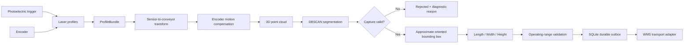
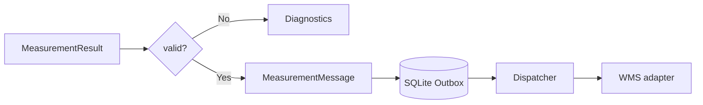

# Conveyor Dimensioning System

<p align="center">
  <strong>3D computer vision / laser profilometry system for measuring product dimensions on a moving conveyor</strong>
</p>

<p align="center">
  Python · Open3D · 3D Geometry · Laser Profilometry · Encoder Registration · DBSCAN · WMS Integration
</p>

---

## Overview

This project is an engineering prototype of an automated dimensioning station for warehouse conveyors.

The system is designed to estimate the **length, width and height of a product while it is moving on a conveyor**, using synchronized laser profiles from several viewpoints. The software reconstructs the observed 3D geometry in a common conveyor coordinate system, compensates for belt motion using an encoder, rejects unreliable captures and calculates product dimensions from an oriented 3D bounding box.

The prototype was developed for an **Ozon Tech / Innopolis University engineering assignment**.

> **Project status:** the geometry pipeline, data contracts, synthetic benchmark, validation logic and WMS outbox are implemented. The repository does **not** claim that the final physical installation has already achieved the target metrology accuracy. Real sensor calibration and stand validation are still required.

---

## What the system solves

In warehouse automation, product dimensions are needed for storage planning, packaging, routing and sorting.

Manual measurement is slow and does not scale to conveyor throughput. A production dimensioning station therefore needs to:

- measure products without stopping the conveyor;
- reconstruct geometry from several viewpoints;
- compensate for conveyor movement;
- detect incomplete or ambiguous observations;
- reject unreliable measurements instead of silently returning incorrect dimensions;
- send accepted measurements to warehouse software.

The target operating range of the assignment is:

| Parameter | Target |
|---|---:|
| Conveyor width | **600 mm** |
| Conveyor speed | **1 m/s** |
| Minimum product | **10 × 10 × 10 mm** |
| Maximum product | **400 × 300 × 300 mm** |
| Required tolerance | **± max(5%, 5 mm)** per dimension |

---

## Proposed hardware layout

The qualification-stage design uses three laser line profilers around the conveyor:

- one sensor above the belt;
- one sensor on the left;
- one sensor on the right;
- a conveyor encoder for motion compensation;
- a photoelectric trigger for object events.

<p align="center">
  
</p>

### Coordinate system

- **X** — conveyor motion direction;
- **Y** — across the belt;
- **Z** — height above the conveyor surface.

Proposed optical reference points:

| Device | Position, mm | Orientation |
|---|---:|---|
| Top Gocator | `(0, 0, 1300)` | downward |
| Left Gocator | `(-150, -1100, 300)` | toward conveyor center |
| Right Gocator | `(+150, +1100, 300)` | toward conveyor center |
| Trigger sensor | `(-350, -400, 5)` | across conveyor |
| Encoder | near measurement zone | measuring wheel on belt |

The proposed sensor candidate is **LMI Gocator 2690 Remastered**, synchronized with an encoder and shared timing hardware.

---

## Field-of-view analysis

Before building the frame, the sensor geometry was checked against the required **600 × 600 mm working section**.

For the top profiler mounted at `Z = 1300 mm`, a conservative linear interpolation of the sensor's specified field-of-view gives approximately:

| Product surface height | Distance to sensor | Estimated profile width |
|---:|---:|---:|
| 0 mm | 1300 mm | 1400.9 mm |
| 300 mm | 1000 mm | 1088.3 mm |
| 600 mm | 700 mm | **775.7 mm** |

Even at the upper boundary of the working volume, the preliminary field of view remains wider than the required 600 mm section.

<p align="center">
  
</p>

This is a **geometric coverage estimate**, not a proof of final measurement accuracy. Mounting hardware, occlusion, reflectivity and real calibration still have to be validated on the physical stand.

---

## System architecture



The important architectural decision is that a bad capture is **not forced into a numeric answer**. Missing viewpoints, profile gaps, multiple detected objects and ROI boundary contact can produce a controlled `rejected` result.

---

## 3D measurement pipeline

### 1. Profile acquisition

Every laser profile carries the information needed for reproducible reconstruction:

```text
sensor_id
profile_index
captured_at_ns
encoder_count
points_sensor_mm
valid_mask
intensity
calibration_id
```

Offline NPZ replay uses the same contract expected from a future live sensor adapter.

### 2. Coordinate registration

Each sensor has a rigid `4 × 4` transform from its local coordinate frame to the conveyor coordinate system.

```text
sensor coordinates
        ↓
rigid calibration transform
        ↓
conveyor coordinates
```

### 3. Conveyor motion compensation

Because the left, top and right sections are captured at different X positions, the object moves between observations.

The pipeline uses the encoder to register all observations to a common position:

```text
p_ref = T_i · p_i - [s(t) - s(t_ref), 0, 0]
```

This prevents conveyor motion from stretching the reconstructed object along X.

### 4. Object segmentation

The reconstructed point cloud is processed using **DBSCAN**.

The pipeline can:

- remove isolated noise;
- preserve a single supported object;
- detect multiple objects in one measurement event;
- reject ambiguous captures.

### 5. Dimension estimation

For a valid observation, Open3D calculates an approximate oriented bounding box.

The result contains:

```text
length
width
height
center
rotation
point_count
algorithm_version
status
```

The implementation deliberately identifies the current geometry backend as:

```text
open3d-face-aligned-approx
```

It is treated as an engineering baseline, not as a mathematically proven exact minimum-volume bounding box.

---

## Why three viewpoints?

A single top camera or profiler cannot reliably observe all vertical faces of a package.

The proposed system therefore combines:

```text
              TOP
               ↓
          ┌─────────┐
LEFT  →   │ PRODUCT │   ←  RIGHT
          └─────────┘
════════════════════════════ conveyor
```

The three views improve surface coverage while the encoder aligns measurements taken at different conveyor positions.

The system still does not invent invisible geometry. Occluded or insufficiently observed events should be rejected through the quality gates.

---

## Encoder resolution

For a 200 mm measuring-wheel circumference and quadrature decoding of a 1024 PPR encoder:

```text
200 / (4 × 1024) = 0.04883 mm / encoder count
```

Capturing every 25 counts gives approximately:

```text
1.221 mm between profiles
≈ 819 profiles / second at 1 m/s
```

This provides roughly eight longitudinal sections even for a 10 mm long product.

Again, this is a design calculation. Wheel slip, belt mechanics and timing accuracy must be measured during stand calibration.

---

## Reliability and quality gates

Industrial CV systems should be able to say **"measurement is unreliable"**.

The project explicitly models:

| Situation | Behaviour |
|---|---|
| Missing required sensor | `rejected` |
| Missing profiles | `rejected` |
| Object touching measurement ROI | `rejected` |
| No supported object | `rejected` |
| Multiple supported objects | `rejected` |
| NaN / Inf in geometry | validation error |
| Invalid rigid calibration | validation error |
| Valid single object | dimension estimation |

This was one of the main design goals: prevent downstream WMS systems from receiving plausible-looking but invalid dimensions.

---

## WMS integration

Accepted measurements can be persisted in a **SQLite durable outbox** before delivery to an external warehouse system.



The outbox provides a foundation for:

- retry after network failure;
- idempotent measurement delivery;
- separation of measurement logic from transport logic.

The final HTTP/gRPC WMS contract is intentionally left outside the prototype because it requires the real external API specification.

---

## Verification

The repository includes automated checks for both normal and failure paths.

```bash
uv run pytest -q
uv run ruff check src tests scripts
uv run ruff format --check src tests scripts
uv run mypy src scripts
uv lock --check
uv run python -m scripts.run_demo
uv run python -m scripts.run_benchmark
```

The tests cover cases including:

- invalid numerical data;
- calibration mutation and invalid transforms;
- conveyor contact;
- coplanar point clouds;
- missing viewpoints;
- two products in one event;
- isolated outliers;
- replayed laser profiles;
- encoder-based registration;
- end-to-end `ProfileBundle → MeasurementResult`.

---

## Synthetic demo

The shortest reproducible demo measures an idealized box:

```bash
uv run python -m scripts.run_demo
```

Expected output:

```text
dimensions_mm=[50.0, 100.0, 200.0]
point_count=8
algorithm=open3d-face-aligned-approx
```

A synthetic benchmark additionally covers the target range boundaries, including:

```text
10 × 10 × 10 mm
400 × 300 × 300 mm
```

These checks validate deterministic software geometry. They **do not** substitute for physical metrology.

---

## Physical validation plan

Before claiming compliance with the required measurement tolerance, the proposed system should pass three stages.

```text
1 sensor
   ↓
basic signal / material / FOV qualification

3 sensors
   ↓
cross-sensor calibration + encoder registration

full acceptance campaign
   ↓
36 samples × 5 angles × 3 Y positions × 10 repetitions
   =
5400 conveyor passes
```

For every pass, all three dimensions must satisfy:

```text
|predicted_dimension - reference_dimension|
    <= max(0.05 × reference_dimension, 5 mm)
```

Rejected, skipped and duplicated events remain part of the acceptance statistics rather than being silently removed.

---

## Technology stack

| Area | Technology |
|---|---|
| Language | Python 3.12 |
| 3D geometry | Open3D |
| Numerical processing | NumPy |
| Segmentation | DBSCAN |
| Motion registration | Encoder-based rigid geometry |
| Persistence | SQLite |
| Testing | pytest |
| Static analysis | mypy |
| Code quality | Ruff + pre-commit |
| Dependency management | uv |
| CI | GitHub Actions |

A GPU is intentionally not required by the current geometric pipeline.

---

## Repository structure

```text
src/ozon_dim/
├── acquisition/       laser profiles, replay, encoder registration
├── preprocessing/     foreground processing and DBSCAN segmentation
├── geometry/          rigid transforms and oriented bounding boxes
├── measurement/       observations, dimensions and validation
└── api/               messages, SQLite outbox and dispatch

scripts/
├── run_demo.py
└── run_benchmark.py

tests/
├── unit/
└── integration/

docs/
├── architecture.md
├── hardware.md
├── requirements.md
├── verification.md
├── calibration.md
├── wms_contract.md
└── final_audit.md

output/pdf/
└── ozon_variant_1_report.pdf
```

---

## Engineering decisions

This repository is not just a computer-vision notebook. It covers the whole measurement path:

**sensor geometry → synchronization → 3D reconstruction → segmentation → measurement → validation → reliable delivery**

Several decisions are particularly important:

- **encoder-based registration** instead of assuming constant conveyor velocity;
- **three viewpoints** instead of relying on a single depth view;
- **explicit rejection states** instead of returning dimensions for incomplete observations;
- **durable outbox** instead of coupling WMS delivery directly to measurement;
- **reproducible offline replay** for debugging sensor data;
- **transparent limitations** instead of presenting synthetic tests as physical accuracy measurements.

---

## Current limitations

The software prototype is deliberately explicit about what has **not yet been proven**:

- no live LMI SDK adapter is included;
- the proposed physical rig has not been built and calibrated;
- target accuracy on real products has not been experimentally demonstrated;
- transparent, black, reflective and deformable materials require physical testing;
- the current Open3D box is an approximate OBB, not a verified exact MVBB;
- final WMS endpoint, authentication and SLA depend on the external integration contract.

These are the main steps between the current prototype and a production dimensioning station.

---

## Quick start

Requires **Python 3.12**.

```bash
python -m pip install uv
uv sync --all-groups --frozen

uv run python -m scripts.run_demo
uv run python -m scripts.run_benchmark
```

Run the full verification suite:

```bash
uv run pytest -q
uv run ruff check src tests scripts
uv run ruff format --check src tests scripts
uv run mypy src scripts
uv lock --check
```

---

## Documentation

Detailed engineering documentation is available in:

- [`docs/architecture.md`](docs/architecture.md) — data contracts and processing pipeline
- [`docs/hardware.md`](docs/hardware.md) — sensor selection, installation geometry and FOV calculations
- [`docs/requirements.md`](docs/requirements.md) — acceptance criteria and traceability
- [`docs/verification.md`](docs/verification.md) — automatic checks and physical validation boundary
- [`docs/final_audit.md`](docs/final_audit.md) — implementation readiness audit
- [`output/pdf/ozon_variant_1_report.pdf`](output/pdf/ozon_variant_1_report.pdf) — engineering report

---

<p align="center">
  <strong>Conveyor Dimensioning System</strong><br>
  From synchronized laser profiles to validated 3D dimensions and WMS delivery.
</p>
